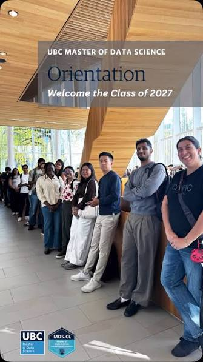

My first week in the UBC Master of Data Science (MDS) Vancouver program has been an exciting introduction to what promises to be an intense and rewarding year. The first few days focused on getting familiar with the program, meeting my classmates and instructors, and adjusting to the pace of the coursework. There is already a lot to learn, but it has been great to finally begin the program and start working with the tools and concepts that will form the foundation of the months ahead.

During the first week, we began working across several areas of data science, including programming, statistics, data manipulation, and version control. I have been getting more comfortable working with Python and R while also learning how Git and GitHub fit into a collaborative data science workflow. The hands-on labs and assignments have made it clear that the program will require a lot of practice and problem-solving rather than simply learning concepts in isolation.

Overall, my first week at UBC MDS has been challenging but encouraging. There have already been moments where I have had to troubleshoot code, learn unfamiliar tools, and rethink concepts that initially seemed confusing. At the same time, each problem I solve makes me a little more comfortable with the data science workflow. This is only the beginning, and I am looking forward to seeing how much my technical skills and understanding of data science develop throughout the program.

